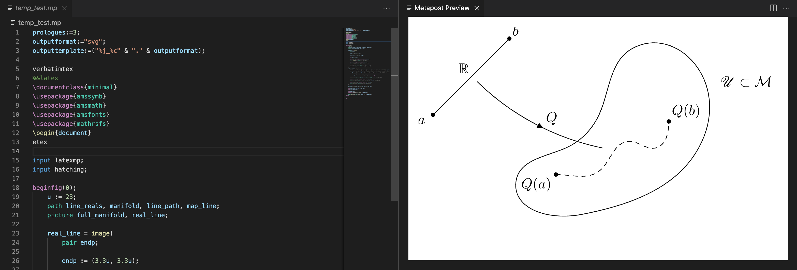

# vscode-metapost

Language support for the MetaPost TeX drawing language.

## Features

Currently available features:

- Adds colourized syntax highlighting to any `.mp` file. Embedded LaTeX, either via `btex`/`etex` blocks, or `verbatimtex` are automatically LaTeX highlighted.

- Preview image to the side, with update on save

## Known Issues

Macro invocation highlighting does not yet work as intended, thus has been left out.

**Please note** I am writing this extension as I learn MetaPost; specifically the grammar used in the syntax highlighting will be incomplete / error prone.

Please get in contact with me to request changes, or submit a PR on the GitHub.

Thank you :~)

## Release Notes

### 0.1.4

Updated syntax highlighting keywords.

### 0.1.3

Set working directory to the file directory, not the workspace.

### 0.1.2

Removed the sandbox (caused too many issues if user is importing custom libraries). Also added quick selection for when multiple figures created.

### 0.1.1

Bugfix: registering activation events

### 0.1.0

Minimally working Metapost previewer, using VSCode webviews.

### 0.0.2

Added a creative commons logo.

### 0.0.1

Initial release, with minimal grammar defined.