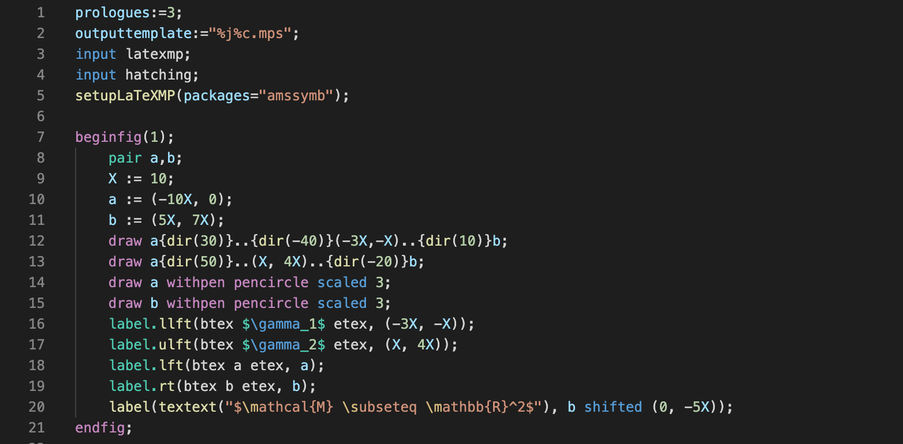

# vscode-metapost

Syntax highlighting for the MetaPost TeX drawing language.

## Features

Adds colorized syntax highlighting to any `.mp` file. Embedded LaTeX, either via `btex`/`etex` blocks, or `verbatimtex` are automatically LaTeX highlighted.

## Known Issues

Macro invocation highlighting does not yet work as intended, thus has been left out.

## Release Notes

### 0.0.1

Initial release, with minimal grammar defined.